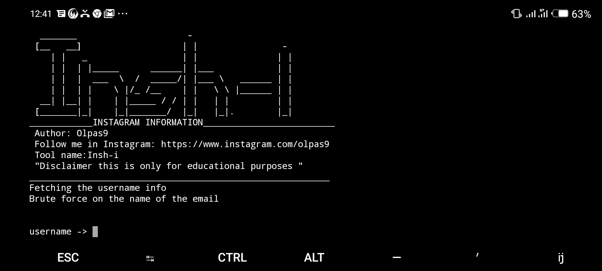

# Insh-i
Get Instagram information of any account together with email for recovery.<br>
# Author
- GitHub: Olpas9
- Instagram: https://www.instagram.com/olpas9
<br>
<br>
<br>
<br>

# installation in termux
1. ``` pkg update && pkg upgrade```
2. ``` termux-setup-storage```
3. ``` pkg install git```
4. ``` pkg install python```
5. ``` git clone https://github.com/Olpas9/Insh-i```
6. ``` cd Insh-i```
7. ``` pip install quidam ```
8. ``` python Inshack.py```
<br>
<br>

# installation in linux
```
git clone https://github.com/Olpas9/Insh-i 
cd Insh-i
python Inshack.py

```
<br>
<br>

# usage
- Follow me in Instagram for more information about  usage of this script
